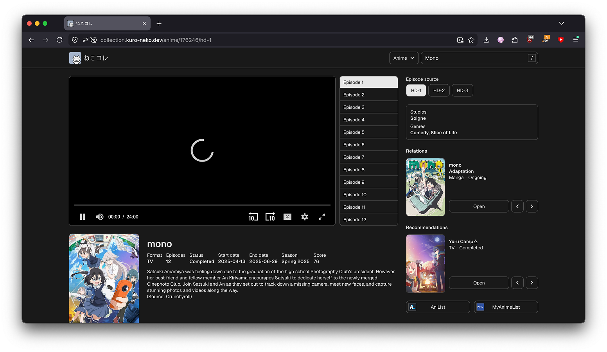

# nekoCollection

nekoCollection is a simple web app that lets you browse anime and manga using data from Consumet API.



👉 [Try it out](https://collection.kuro-neko.dev)

## 📦 Setup

### 1. Clone

```shell
git clone https://github.com/neko-aleph/nekoCollection.git
cd nekoCollection
```

### 2. Install deps

```shell
npm install
```

### 3. Environment

Create `.env` file:

```dotenv
# Consumet API instance base URL
VITE_API_URL=your_consumet_api_url

# CORS proxy URL (e.g. https://github.com/warren-bank/node-HLS-Proxy)
VITE_CORS_PROXY_URL=your_cors_proxy_url

# Iframe provider URLs. Works with any provider using the /[anilistId]/[episodeId]/[subOrDub] structure (e.g. vidnest.fun or animeplay.cfd)
VITE_EMBED_PLAYER_URL=embed_provider_1_url
VITE_OTHER_EMBED_PLAYER_URL=embed_provider_2_url
```

### Run

```shell
npm run dev
```

### Build

```shell
npm run build
```